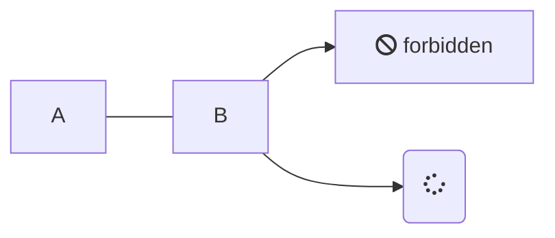

# 自分用メモ

## gitコマンド
  * git-flowプラグインに代表される、推奨されるbranchモデルについて
    

## gitデーモン

  * gitプロトコルを通す場合、gitデーモンを稼働させる必要がある。
  * gitデーモンのインストールは、apt-get installで可能。
  * 外部からcloneを許可する為には、gitプロトコルで公開しているフォルダに「git-daemon-export-ok」という空ファイルを準備する必要がある。
  * gitデーモンは、サービスとして登録するのが一般的。

  * サービス登録が上手くできなかった場合、rcからgit-daemonをバックグラウンド実行すれば対応できた。

### 問題
  * gitデーモンをセットアップ後、git clone したリポジトリから、git push すると、エラー発生する。  
        fatal: remote error: access denied or repository not exported: /path/to/sample.git

  * git clone は出来ても、git push に失敗する場合、git-daemonの起動オプション「--enable=receive-pack」が不足している可能性が高い。  

    * 旧オプション  
        git daemon --reuseaddr --base-path=/var/lib/git/ /var/lib/git/ &
    * 新オプション  
        git daemon --reuseaddr --base-path=/var/lib/git/ --enable=receive-pack /var/lib/git/ &

